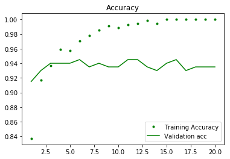
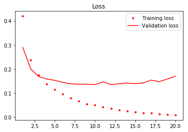
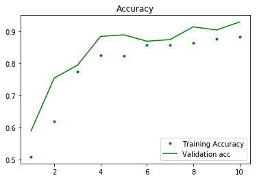
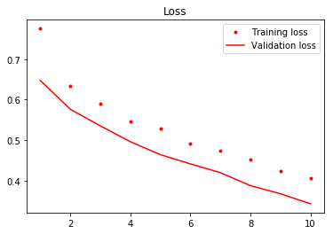
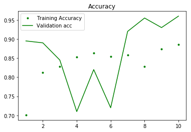
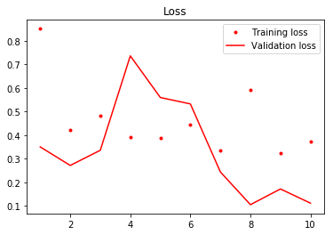

# Using Pretrained Networks - Lab

## Introduction

In this lab, you'll further practice the ideas behind CNN and adapting pretrained models as described in previous lessons. (As you may have guessed, our problem at hand is classifying Santa or Not Santa!). With that, let's have at it! 

## Objectives

You will be able to:
* Use Keras to adapt a pretrained CNN
* Implement feature engineering and fine tuning on a pretrained model


```python
import datetime

start = datetime.datetime.now()
```


```python
import os, shutil
import time
import matplotlib.pyplot as plt
import scipy
import numpy as np
from PIL import Image
from scipy import ndimage
from keras.preprocessing.image import ImageDataGenerator, array_to_img

np.random.seed(123)
```

    /Users/matthew.mitchell/anaconda3/lib/python3.6/site-packages/h5py/__init__.py:36: FutureWarning: Conversion of the second argument of issubdtype from `float` to `np.floating` is deprecated. In future, it will be treated as `np.float64 == np.dtype(float).type`.
      from ._conv import register_converters as _register_converters
    Using TensorFlow backend.


```python
train_folder = 'split/train'
test_folder = 'split/test'
val_folder = 'split/validation'
```


```python
datagen = ImageDataGenerator(rescale=1./255) 
batch_size = 10
```

## VGG19: Feature extraction


```python
from keras.applications import VGG19
cnn_base = VGG19(weights='imagenet',
                  include_top=False,
                  input_shape=(64, 64, 3))
```


```python
cnn_base.summary()
```

    _________________________________________________________________
    Layer (type)                 Output Shape              Param #   
    =================================================================
    input_1 (InputLayer)         (None, 64, 64, 3)         0         
    _________________________________________________________________
    block1_conv1 (Conv2D)        (None, 64, 64, 64)        1792      
    _________________________________________________________________
    block1_conv2 (Conv2D)        (None, 64, 64, 64)        36928     
    _________________________________________________________________
    block1_pool (MaxPooling2D)   (None, 32, 32, 64)        0         
    _________________________________________________________________
    block2_conv1 (Conv2D)        (None, 32, 32, 128)       73856     
    _________________________________________________________________
    block2_conv2 (Conv2D)        (None, 32, 32, 128)       147584    
    _________________________________________________________________
    block2_pool (MaxPooling2D)   (None, 16, 16, 128)       0         
    _________________________________________________________________
    block3_conv1 (Conv2D)        (None, 16, 16, 256)       295168    
    _________________________________________________________________
    block3_conv2 (Conv2D)        (None, 16, 16, 256)       590080    
    _________________________________________________________________
    block3_conv3 (Conv2D)        (None, 16, 16, 256)       590080    
    _________________________________________________________________
    block3_conv4 (Conv2D)        (None, 16, 16, 256)       590080    
    _________________________________________________________________
    block3_pool (MaxPooling2D)   (None, 8, 8, 256)         0         
    _________________________________________________________________
    block4_conv1 (Conv2D)        (None, 8, 8, 512)         1180160   
    _________________________________________________________________
    block4_conv2 (Conv2D)        (None, 8, 8, 512)         2359808   
    _________________________________________________________________
    block4_conv3 (Conv2D)        (None, 8, 8, 512)         2359808   
    _________________________________________________________________
    block4_conv4 (Conv2D)        (None, 8, 8, 512)         2359808   
    _________________________________________________________________
    block4_pool (MaxPooling2D)   (None, 4, 4, 512)         0         
    _________________________________________________________________
    block5_conv1 (Conv2D)        (None, 4, 4, 512)         2359808   
    _________________________________________________________________
    block5_conv2 (Conv2D)        (None, 4, 4, 512)         2359808   
    _________________________________________________________________
    block5_conv3 (Conv2D)        (None, 4, 4, 512)         2359808   
    _________________________________________________________________
    block5_conv4 (Conv2D)        (None, 4, 4, 512)         2359808   
    _________________________________________________________________
    block5_pool (MaxPooling2D)   (None, 2, 2, 512)         0         
    =================================================================
    Total params: 20,024,384
    Trainable params: 20,024,384
    Non-trainable params: 0
    _________________________________________________________________


```python
def extract_features(directory, sample_amount):
    features = np.zeros(shape=(sample_amount, 2, 2, 512)) 
    labels = np.zeros(shape=(sample_amount))
    generator = datagen.flow_from_directory(
        directory, target_size=(64, 64), 
        batch_size = 10, 
        class_mode='binary')
    i=0
    for inputs_batch, labels_batch in generator:
        features_batch = cnn_base.predict(inputs_batch)
        features[i * batch_size : (i + 1) * batch_size] = features_batch 
        labels[i * batch_size : (i + 1) * batch_size] = labels_batch
        i = i + 1
        if i * batch_size >= sample_amount:
            break
    return features, labels
```


```python
# you should be able to divide sample_amount by batch_size!!
train_features, train_labels = extract_features(train_folder, 540) 
validation_features, validation_labels = extract_features(val_folder, 200) 
test_features, test_labels = extract_features(test_folder, 180)

train_features = np.reshape(train_features, (540, 2 * 2 * 512))
validation_features = np.reshape(validation_features, (200, 2 * 2 * 512))
test_features = np.reshape(test_features, (180, 2 * 2 * 512))
```

    Found 542 images belonging to 2 classes.
    Found 200 images belonging to 2 classes.
    Found 180 images belonging to 2 classes.


```python
from keras import models
from keras import layers
from keras import optimizers

model = models.Sequential()
model.add(layers.Dense(256, activation='relu', input_dim=2 * 2 * 512))
model.add(layers.Dense(1, activation='sigmoid'))

model.compile(optimizer=optimizers.RMSprop(lr=1e-4),
              loss='binary_crossentropy',
              metrics=['acc'])
history = model.fit(train_features, train_labels,
                    epochs=20,
                    batch_size=10,
                    validation_data=(validation_features, validation_labels))
```

    Train on 540 samples, validate on 200 samples
    Epoch 1/20
    540/540 [==============================] - 0s 822us/step - loss: 0.4196 - acc: 0.8370 - val_loss: 0.2900 - val_acc: 0.9150
    Epoch 2/20
    540/540 [==============================] - 0s 430us/step - loss: 0.2363 - acc: 0.9167 - val_loss: 0.1999 - val_acc: 0.9300
    Epoch 3/20
    540/540 [==============================] - 0s 427us/step - loss: 0.1742 - acc: 0.9370 - val_loss: 0.1683 - val_acc: 0.9400
    Epoch 4/20
    540/540 [==============================] - 0s 431us/step - loss: 0.1371 - acc: 0.9593 - val_loss: 0.1583 - val_acc: 0.9400
    Epoch 5/20
    540/540 [==============================] - 0s 476us/step - loss: 0.1136 - acc: 0.9574 - val_loss: 0.1527 - val_acc: 0.9400
    Epoch 6/20
    540/540 [==============================] - 0s 434us/step - loss: 0.0964 - acc: 0.9704 - val_loss: 0.1444 - val_acc: 0.9450
    Epoch 7/20
    540/540 [==============================] - 0s 432us/step - loss: 0.0794 - acc: 0.9778 - val_loss: 0.1381 - val_acc: 0.9350
    Epoch 8/20
    540/540 [==============================] - 0s 430us/step - loss: 0.0674 - acc: 0.9852 - val_loss: 0.1368 - val_acc: 0.9400
    Epoch 9/20
    540/540 [==============================] - 0s 446us/step - loss: 0.0548 - acc: 0.9907 - val_loss: 0.1366 - val_acc: 0.9350
    Epoch 10/20
    540/540 [==============================] - 0s 435us/step - loss: 0.0511 - acc: 0.9889 - val_loss: 0.1353 - val_acc: 0.9350
    Epoch 11/20
    540/540 [==============================] - 0s 489us/step - loss: 0.0422 - acc: 0.9926 - val_loss: 0.1464 - val_acc: 0.9450
    Epoch 12/20
    540/540 [==============================] - 0s 441us/step - loss: 0.0361 - acc: 0.9944 - val_loss: 0.1347 - val_acc: 0.9450
    Epoch 13/20
    540/540 [==============================] - 0s 435us/step - loss: 0.0301 - acc: 0.9981 - val_loss: 0.1387 - val_acc: 0.9350
    Epoch 14/20
    540/540 [==============================] - 0s 430us/step - loss: 0.0262 - acc: 0.9944 - val_loss: 0.1414 - val_acc: 0.9300
    Epoch 15/20
    540/540 [==============================] - 0s 451us/step - loss: 0.0220 - acc: 1.0000 - val_loss: 0.1389 - val_acc: 0.9400
    Epoch 16/20
    540/540 [==============================] - 0s 427us/step - loss: 0.0176 - acc: 1.0000 - val_loss: 0.1420 - val_acc: 0.9450
    Epoch 17/20
    540/540 [==============================] - 0s 447us/step - loss: 0.0163 - acc: 1.0000 - val_loss: 0.1536 - val_acc: 0.9300
    Epoch 18/20
    540/540 [==============================] - 0s 425us/step - loss: 0.0119 - acc: 1.0000 - val_loss: 0.1475 - val_acc: 0.9350
    Epoch 19/20
    540/540 [==============================] - 0s 427us/step - loss: 0.0114 - acc: 1.0000 - val_loss: 0.1581 - val_acc: 0.9350
    Epoch 20/20
    540/540 [==============================] - 0s 427us/step - loss: 0.0089 - acc: 1.0000 - val_loss: 0.1699 - val_acc: 0.9350


```python
results_test = model.evaluate(test_features, test_labels)
results_test
```

    180/180 [==============================] - 0s 59us/step


    [0.23546737531820933, 0.933333334657881]


```python
train_acc = history.history['acc']
val_acc = history.history['val_acc']
train_loss = history.history['loss']
val_loss = history.history['val_loss']
epch = range(1, len(train_acc) + 1)
plt.plot(epch, train_acc, 'g.', label='Training Accuracy')
plt.plot(epch, val_acc, 'g', label='Validation acc')
plt.title('Accuracy')
plt.legend()
plt.figure()
plt.plot(epch, train_loss, 'r.', label='Training loss')
plt.plot(epch, val_loss, 'r', label='Validation loss')
plt.title('Loss')
plt.legend()
plt.show()
```








Using VGG19 we were able to get test set performance up to almost 92%. Quite impressive!


```python
end = datetime.datetime.now()
elapsed = end - start
print('Feature extraction method 1 took {} to execute.'.format(elapsed))
startp = datetime.datetime.now() #Set new start time for new process method
```

    Feature extraction method 1 took 0:01:14.165131 to execute.


## Feature Extraction: Method 2

Here, we will investigate another method for performming feature extraction which will seque naturally into methods for fine tuning a pretrained network. This method of feature extraction is more costly then the previous methodology but has some added benefits in that it will allow us to also perform our usual data augmentation techniques.  

Here's an overview of the process:
* Add the pretrained model as the first layer
* Add some dense layers for a classifier on top
* Freeze the convolutional base
* Train the model

The new part of this process which you are unfamiliar with is freezing layers. This means that all of the weights associated with that layer(s) will remain unchanged through the optimization process. Freezing the base is important as we wish to preserve the features encoded in this CNN base.


```python
model = models.Sequential()
model.add(cnn_base)
model.add(layers.Flatten())
model.add(layers.Dense(132, activation='relu'))
model.add(layers.Dense(1, activation='sigmoid'))
```

## Freezing

Now that we've designed the model architecture, we can go ahead and freeze the base. First, let's look at how to check whether layers are frozen or not:


```python
#You can check whether a layer is trainable (or alter its setting) through the layer.trainable attribute:
for layer in model.layers:
    print(layer.name, layer.trainable)
    
#Similarly, we can check how many trainable weights are in the model:
print(len(model.trainable_weights))
```

    vgg19 True
    flatten_1 True
    dense_3 True
    dense_4 True
    36


And now let's freeze our cnn base layer:


```python
cnn_base.trainable = False
```

and do a quick sanity check:


```python
#You can check whether a layer is trainable (or alter its setting) through the layer.trainable attribute:
for layer in model.layers:
    print(layer.name, layer.trainable)
    
#Similarly, we can check how many trainable weights are in the model:
print(len(model.trainable_weights))
```

    vgg19 False
    flatten_1 True
    dense_3 True
    dense_4 True
    4


From there, training the model happens as usual.   

We define our training-validation-test sets (now with data augmentation; the advantage of this method of feature-extraction).


```python
# get all the data in the directory split/train (542 images), and reshape them
train_datagen = ImageDataGenerator(
      rescale=1./255,
      rotation_range=40,
      width_shift_range=0.2,
      height_shift_range=0.2,
      shear_range=0.2,
      zoom_range=0.2,
      horizontal_flip=True,
      fill_mode='nearest')

train_generator = train_datagen.flow_from_directory(
        train_folder, 
        target_size=(64, 64), 
        batch_size= 20,
        class_mode= 'binary') 

# get all the data in the directory split/validation (200 images), and reshape them
val_generator = ImageDataGenerator(rescale=1./255).flow_from_directory(
        val_folder, 
        target_size=(64, 64), 
        batch_size = 20,
        class_mode= 'binary')

# get all the data in the directory split/test (180 images), and reshape them
test_generator = ImageDataGenerator(rescale=1./255).flow_from_directory(
        test_folder, 
        target_size=(64, 64), 
        batch_size = 180,
        class_mode= 'binary')

test_images, test_labels = next(test_generator)
```

    Found 542 images belonging to 2 classes.
    Found 200 images belonging to 2 classes.
    Found 180 images belonging to 2 classes.


Compile the model as usual:


```python
model.compile(loss='binary_crossentropy',
              optimizer=optimizers.RMSprop(lr=2e-5),
              metrics=['acc'])
```

And fit the model:


```python
history = model.fit_generator(
              train_generator,
              steps_per_epoch= 27,
              epochs = 10,
              validation_data = val_generator,
              validation_steps = 10)
```

    Epoch 1/10
    27/27 [==============================] - 36s 1s/step - loss: 0.7754 - acc: 0.5093 - val_loss: 0.6475 - val_acc: 0.5900
    Epoch 2/10
    27/27 [==============================] - 32s 1s/step - loss: 0.6349 - acc: 0.6168 - val_loss: 0.5764 - val_acc: 0.7550
    Epoch 3/10
    27/27 [==============================] - 33s 1s/step - loss: 0.5876 - acc: 0.7831 - val_loss: 0.5353 - val_acc: 0.7950
    Epoch 4/10
    27/27 [==============================] - 33s 1s/step - loss: 0.5558 - acc: 0.7991 - val_loss: 0.4962 - val_acc: 0.8850
    Epoch 5/10
    27/27 [==============================] - 34s 1s/step - loss: 0.5289 - acc: 0.8294 - val_loss: 0.4642 - val_acc: 0.8900
    Epoch 6/10
    27/27 [==============================] - 33s 1s/step - loss: 0.4927 - acc: 0.8467 - val_loss: 0.4414 - val_acc: 0.8700
    Epoch 7/10
    27/27 [==============================] - 33s 1s/step - loss: 0.4876 - acc: 0.8467 - val_loss: 0.4198 - val_acc: 0.8750
    Epoch 8/10
    27/27 [==============================] - 33s 1s/step - loss: 0.4591 - acc: 0.8523 - val_loss: 0.3878 - val_acc: 0.9150
    Epoch 9/10
    27/27 [==============================] - 33s 1s/step - loss: 0.4156 - acc: 0.8813 - val_loss: 0.3677 - val_acc: 0.9050
    Epoch 10/10
    27/27 [==============================] - 32s 1s/step - loss: 0.4012 - acc: 0.8869 - val_loss: 0.3430 - val_acc: 0.9300


```python
train_acc = history.history['acc']
val_acc = history.history['val_acc']
train_loss = history.history['loss']
val_loss = history.history['val_loss']
epch = range(1, len(train_acc) + 1)
plt.plot(epch, train_acc, 'g.', label='Training Accuracy')
plt.plot(epch, val_acc, 'g', label='Validation acc')
plt.title('Accuracy')
plt.legend()
plt.figure()
plt.plot(epch, train_loss, 'r.', label='Training loss')
plt.plot(epch, val_loss, 'r', label='Validation loss')
plt.title('Loss')
plt.legend()
plt.show()
```








Comment: since both training and validation accuracy continue to fall in these graphs we would normally train for more epochs. To keep things running smoothly though, we won't do that here.


```python
end = datetime.datetime.now()
elapsed = end - startp
print('Feature extraction method 2 took {} to execute.'.format(elapsed))
elapsed = end - start
print('Total running time of notebook thus far: {}'.format(elapsed))
startp = datetime.datetime.now() #Set new start time for new process method
```

    Feature extraction method 2 took 0:18:45.504135 to execute.
    Total running time of notebook thus far: 1:19:34.698920


## Fine Tuning

Fine tuning starts with the same procedure that we have demonstrated for feature extraction. From there, we further fine-tune the weights of the most abstract layers of the convolutional base. 

When fine-tuning these layers from the convolutional base, it is essential that you first freeze the entire convolutional base and train a classifier as we discussed with the feature engineering technique above. Without this, when gradient descent is initialized to optimize our loss function, we would be apt to loose any significant patterns learned by the original classifier that we are adapting to our current situation. As a result, we must first tune the fully-connected classifier that sits on top of the pretrained convolutional base. From there, our model should have a relatively strong accuracy and we can fine tune the weights of the last few layers of the convolutional base. Unfreezing initial layers of the convolutional base is not apt to produce substantial gains as these early layers typically learn simple representations such as colors and edges which are typically useful in all forms of image recognition, regardless of application.   

With that, let's continue fine-tuning our model.

**Warning: Fine tuning can be a resource intensive procedure.**

Recall that we have our overall model:


```python
model.summary()
```

    _________________________________________________________________
    Layer (type)                 Output Shape              Param #   
    =================================================================
    vgg19 (Model)                (None, 2, 2, 512)         20024384  
    _________________________________________________________________
    flatten_1 (Flatten)          (None, 2048)              0         
    _________________________________________________________________
    dense_3 (Dense)              (None, 132)               270468    
    _________________________________________________________________
    dense_4 (Dense)              (None, 1)                 133       
    =================================================================
    Total params: 270,601
    Trainable params: 270,601
    Non-trainable params: 0
    _________________________________________________________________


    /Users/matthew.mitchell/anaconda3/lib/python3.6/site-packages/keras/engine/training.py:490: UserWarning: Discrepancy between trainable weights and collected trainable weights, did you set `model.trainable` without calling `model.compile` after ?
      'Discrepancy between trainable weights and collected trainable'


And we can also further investigate our borrowed convolutional base:


```python
cnn_base.summary()
```

    _________________________________________________________________
    Layer (type)                 Output Shape              Param #   
    =================================================================
    input_1 (InputLayer)         (None, 64, 64, 3)         0         
    _________________________________________________________________
    block1_conv1 (Conv2D)        (None, 64, 64, 64)        1792      
    _________________________________________________________________
    block1_conv2 (Conv2D)        (None, 64, 64, 64)        36928     
    _________________________________________________________________
    block1_pool (MaxPooling2D)   (None, 32, 32, 64)        0         
    _________________________________________________________________
    block2_conv1 (Conv2D)        (None, 32, 32, 128)       73856     
    _________________________________________________________________
    block2_conv2 (Conv2D)        (None, 32, 32, 128)       147584    
    _________________________________________________________________
    block2_pool (MaxPooling2D)   (None, 16, 16, 128)       0         
    _________________________________________________________________
    block3_conv1 (Conv2D)        (None, 16, 16, 256)       295168    
    _________________________________________________________________
    block3_conv2 (Conv2D)        (None, 16, 16, 256)       590080    
    _________________________________________________________________
    block3_conv3 (Conv2D)        (None, 16, 16, 256)       590080    
    _________________________________________________________________
    block3_conv4 (Conv2D)        (None, 16, 16, 256)       590080    
    _________________________________________________________________
    block3_pool (MaxPooling2D)   (None, 8, 8, 256)         0         
    _________________________________________________________________
    block4_conv1 (Conv2D)        (None, 8, 8, 512)         1180160   
    _________________________________________________________________
    block4_conv2 (Conv2D)        (None, 8, 8, 512)         2359808   
    _________________________________________________________________
    block4_conv3 (Conv2D)        (None, 8, 8, 512)         2359808   
    _________________________________________________________________
    block4_conv4 (Conv2D)        (None, 8, 8, 512)         2359808   
    _________________________________________________________________
    block4_pool (MaxPooling2D)   (None, 4, 4, 512)         0         
    _________________________________________________________________
    block5_conv1 (Conv2D)        (None, 4, 4, 512)         2359808   
    _________________________________________________________________
    block5_conv2 (Conv2D)        (None, 4, 4, 512)         2359808   
    _________________________________________________________________
    block5_conv3 (Conv2D)        (None, 4, 4, 512)         2359808   
    _________________________________________________________________
    block5_conv4 (Conv2D)        (None, 4, 4, 512)         2359808   
    _________________________________________________________________
    block5_pool (MaxPooling2D)   (None, 2, 2, 512)         0         
    =================================================================
    Total params: 20,024,384
    Trainable params: 20,024,384
    Non-trainable params: 0
    _________________________________________________________________


## Important Reminders on Fine Tuning: Feature Extraction Must Come First!
Up till now, we have frozen the entire convolutional base. Again, it cannot be stressed enough how important this is before fine tuning the weights of the later layers of this base. Without training a classifier on the frozen base first, there will be too much noise in the model and initial epochs will overwrite any useful representations encoded in the pretrained model. That said, now that we have tuned a classifier to the frozen base, we can now unfreeze a few of the deeper layers from this base and further fine tune them to our problem scenario. In practice, this is apt to be particularly helpful where adapted models span new domain categories. For example, if the pretrained model is on cats and dogs and this is adapted to a problem specific to cats (a very relatively similar domain) there is apt to be little performance gain from fine tuning. On the other hand, if the problem domain is more substantially different, additional gains are more likely in adjusting these more abstract layers of the convolutional base. With that, let's take a look at how to unfreeze and fine tune these later layers.

Previously, we saw how to freeze a layer. Similarly, we will now unfreeze our base:


```python
cnn_base.trainable = True
```

Then, we can refreeze all of them up to a specific layer. Here we're unfreezing the final *block* of layers.
(You will see diminishing returns if you continue to unfreeze additional layers.)


```python
cnn_base.trainable = True
set_trainable = False
for layer in cnn_base.layers:
    if layer.name == 'block5_conv1':
        set_trainable = True
    if set_trainable:
        layer.trainable = True
    else:
        layer.trainable = False
```

Finally, we must recompile our model before performing fitting.


```python
model.compile(loss='binary_crossentropy',
                      optimizer=optimizers.RMSprop(lr=1e-4),
                      metrics=['accuracy'])
```

Afterwards, we can then fit the model as usual.


```python
history = model.fit_generator(
              train_generator,
              steps_per_epoch= 27,
              epochs = 10,
              validation_data = val_generator,
              validation_steps = 10)
```

    Epoch 1/10
    27/27 [==============================] - 43s 2s/step - loss: 0.8492 - acc: 0.6947 - val_loss: 0.3502 - val_acc: 0.8950
    Epoch 2/10
    27/27 [==============================] - 41s 2s/step - loss: 0.4234 - acc: 0.8130 - val_loss: 0.2716 - val_acc: 0.8900
    Epoch 3/10
    27/27 [==============================] - 40s 1s/step - loss: 0.4683 - acc: 0.8331 - val_loss: 0.3359 - val_acc: 0.8450
    Epoch 4/10
    27/27 [==============================] - 40s 1s/step - loss: 0.3880 - acc: 0.8572 - val_loss: 0.7360 - val_acc: 0.7100
    Epoch 5/10
    27/27 [==============================] - 40s 1s/step - loss: 0.3808 - acc: 0.8684 - val_loss: 0.5596 - val_acc: 0.8200
    Epoch 6/10
    27/27 [==============================] - 40s 1s/step - loss: 0.4314 - acc: 0.8591 - val_loss: 0.5324 - val_acc: 0.7200
    Epoch 7/10
    27/27 [==============================] - 39s 1s/step - loss: 0.3363 - acc: 0.8628 - val_loss: 0.2439 - val_acc: 0.9200
    Epoch 8/10
    27/27 [==============================] - 40s 1s/step - loss: 0.5722 - acc: 0.8331 - val_loss: 0.1054 - val_acc: 0.9550
    Epoch 9/10
    27/27 [==============================] - 40s 1s/step - loss: 0.3296 - acc: 0.8616 - val_loss: 0.1719 - val_acc: 0.9300
    Epoch 10/10
    27/27 [==============================] - 40s 1s/step - loss: 0.3616 - acc: 0.8888 - val_loss: 0.1117 - val_acc: 0.9600


```python
train_acc = history.history['acc']
val_acc = history.history['val_acc']
train_loss = history.history['loss']
val_loss = history.history['val_loss']
epch = range(1, len(train_acc) + 1)
plt.plot(epch, train_acc, 'g.', label='Training Accuracy')
plt.plot(epch, val_acc, 'g', label='Validation acc')
plt.title('Accuracy')
plt.legend()
plt.figure()
plt.plot(epch, train_loss, 'r.', label='Training loss')
plt.plot(epch, val_loss, 'r', label='Validation loss')
plt.title('Loss')
plt.legend()
plt.show()
```








## Final Evaluation

As usual, let's conclude with a final evaluation on the test set.


```python
# test_generator = test_datagen.flow_from_directory(
#         test_dir,
#         target_size=(150, 150),
#         batch_size=20,
#         class_mode='binary')
test_loss, test_acc = model.evaluate_generator(test_generator, steps=50)
print('test acc:', test_acc)
```

    test acc: 0.9055555462837219


The model with fine-tuning seems to have similar results, but was much more costly to compute in terms of time.

## Summary

In this lesson, you learned how to adapt a pretrained model to your own application. This can be a useful technique when data is limited (less then tens or hundreds of thousands of examples). To do this, you build a new classifier on top of the original convolutional base. Then, if the category or class of images is substantially different, fine tuning the most abstract layers of the convolutional base may further bolster performance. From here, it's time to fully synthesize all the image recognition techniques you have learned to date and practice with a real world example from a Kaggle competition.
